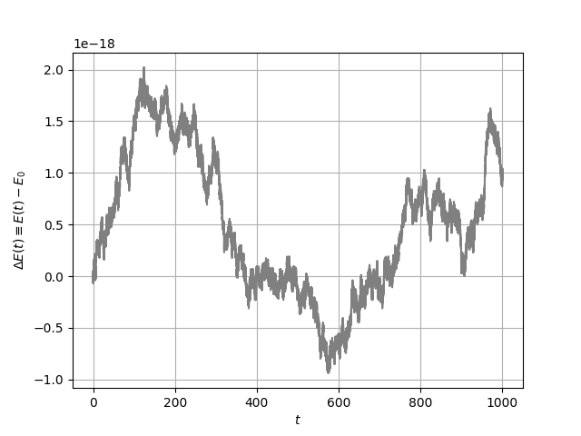

# Gauss-Legendre Solver
A implementation of the Gauss-Legendre method for solving differential equations with high precision, featuring applications to energy-conserving systems.

## Features
- **High Precision Calculations**: Uses `np.float128` for numerical stability.  
- **Energy Analysis**: Ensures energy conservation throughout the simulation.  
- **Customizable and Extendable**: Easily adaptable to other DE systems.  

## Getting Started
To run the project locally:

1. Clone the repository:

```bash
gh repo clone dszv/gauss-legendre-integrator
```

2. Install the required dependencies:

```bash
pip3 install numpy matplotlib
```

3. Run one of the example scripts:

```bash
python3 simple_pendulum.py
```

## Results

### Simple Pendulum

The integrator was applied to simulate the simple pendulum. The following figure shows the energy conservation of the system over time.

<p align="center">
  
</p>

## References

- Butcher, J. C. (1964). *Implicit Runge-Kutta processes*. *Mathematics of Computation*, 18, 50-64.
